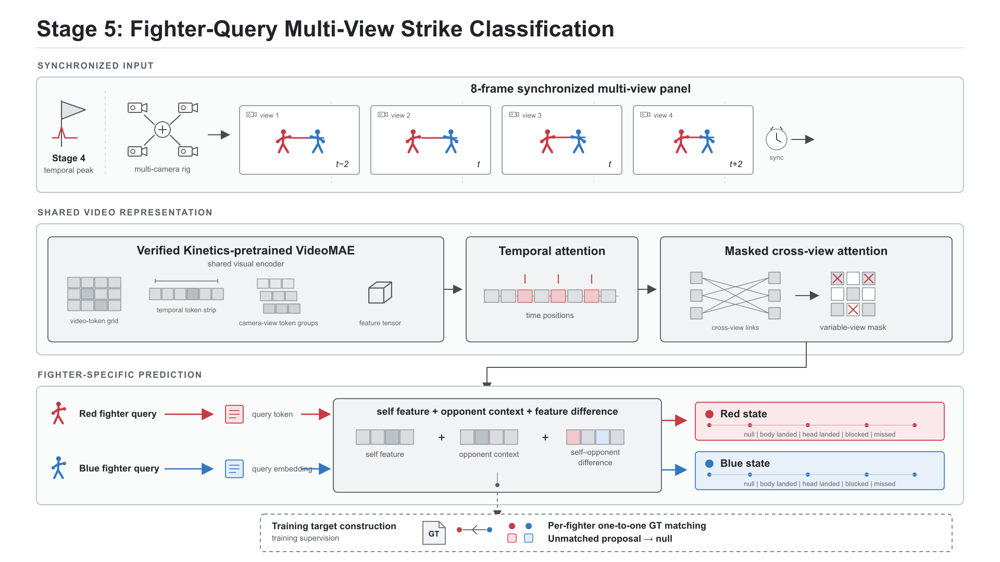

# Boxing CV — Multi-View Strike Localisation

A five-stage computer-vision pipeline for boxing video analysis: from fighter detection
to per-fighter strike-outcome recognition, with synchronised multi-view temporal
consensus as the core contribution.



## Results at a glance (held-out Bout 115)

| Stage | Method | Result |
|---|---|---|
| 4 | rank-normalised multi-view consensus | strict event F1 **0.341 → 0.780** (recall 0.209 → 0.754) |
| 5 | fighter-query VideoMAE | typed event F1 **0.448**, typed macro-F1 **0.257** |

The five stages:

1. **Detect** — red/blue fighter boxes per camera view.
2. **Crop** — a compact crop around the two fighters.
3. **Frame evidence** — per-frame punch probability (Stage-3 classifier).
4. **Consensus** — rank-normalised multi-view fusion of the probability traces into one
   synchronised stream of strike proposals.
5. **Outcome** — per-fighter categorical outcome for each proposal
   (`null`, `body landed`, `head landed`, `blocked`, `missed`).

## Repository layout

```text
report/                            dissertation (LaTeX source + figures + compiled PDF)
core_pipeline/                     inherited five-stage package (bcv) + tests
stage4_multiview_consensus_final/  Stage 4 multi-view consensus
stage5_fighter_query_final/        Stage 5 fighter-query classifier
report_analysis/                   script + CSVs behind the report figures/tables
docs/                              architecture diagrams for this README
```

## Report

The full dissertation is in [`report/`](report/):

- [`report/report.pdf`](report/report.pdf) — compiled PDF (42 pages);
- [`report/elsarticle-template-num.tex`](report/elsarticle-template-num.tex) — LaTeX source;
- [`report/cas-refs.bib`](report/cas-refs.bib) — bibliography.

## Install and run

Python ≥ 3.11, managed with [uv](https://docs.astral.sh/uv/):

```bash
cd core_pipeline
uv sync --extra detect --extra train --extra label
uv run pytest -q          # 80 tests, offline, ~5 s
```

The Stage 4 / Stage 5 experiment scripts are included so the runs can be repeated once the
controlled bout data are restored:

```bash
bash stage4_multiview_consensus_final/run_cv.sh    # Stage 4 sweep + leave-one-bout-out
bash stage5_fighter_query_final/run_build.sh       # Stage 5 feature cache
bash stage5_fighter_query_final/run_matched.sh     # Stage 5 training
bash stage5_fighter_query_final/run_evaluate.sh    # Stage 5 final evaluation
```

Each `run_*.sh` documents its input trees (bout videos, punch labels, fighter boxes,
Stage-3 probabilities and trained checkpoints are controlled project data and are not
bundled).

## Results and provenance

- `stage4_multiview_consensus_final/results_cv/` — parameter sweep, leave-one-bout-out
  development folds, and the held-out Bout 115 result.
- `stage5_fighter_query_final/results/final_retained_result.json` — final Stage 5 numbers
  (typed event F1 0.448 / macro-F1 0.257).
- `stage5_fighter_query_final/results/disentangled_result.json` — clean-GT and activity
  diagnostics.
- `report_analysis/` — CSV tables behind the report figures (view-count ablation,
  temporal-tolerance curve, Stage 5 outcome-family F1, class support).
