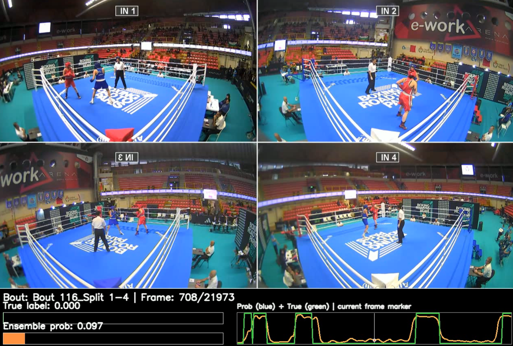
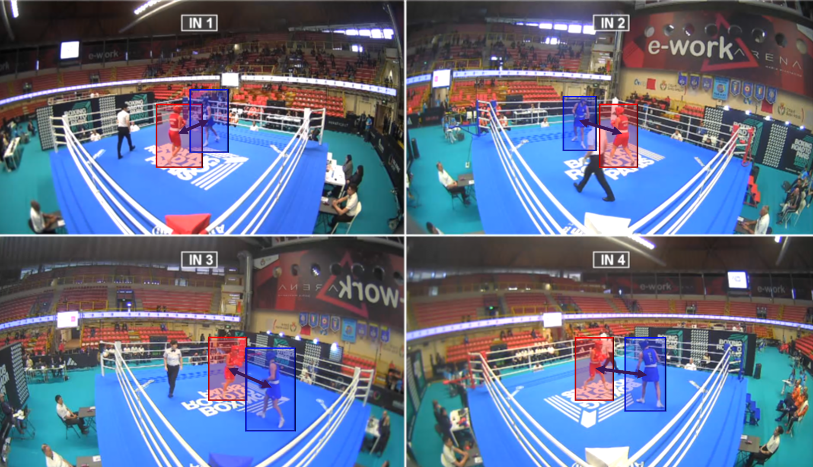
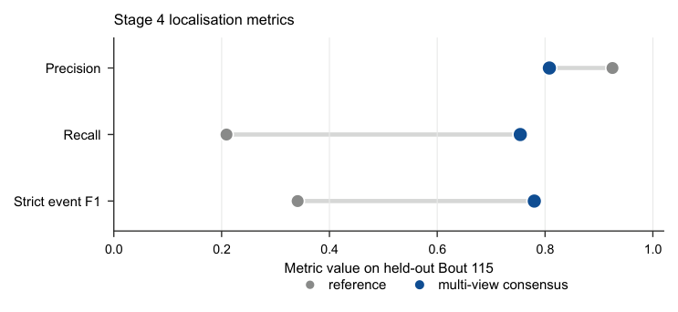
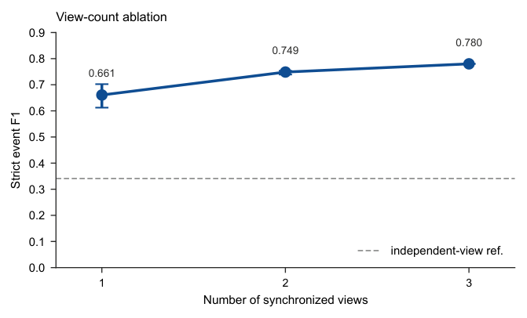
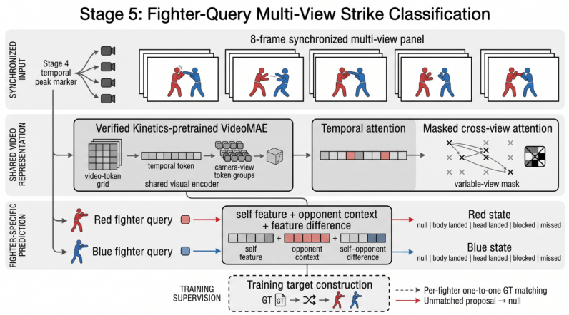
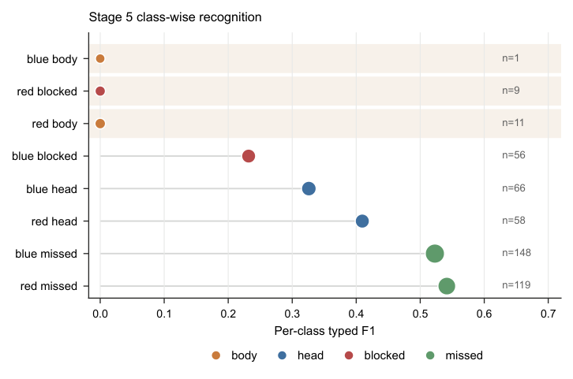
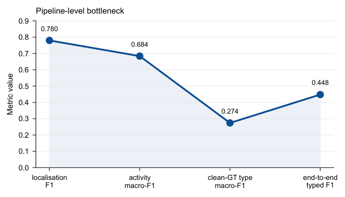

# Boxing CV — Multi-View Strike Localisation

A five-stage computer-vision pipeline for boxing video analysis: it detects the two
fighters in synchronised camera views, crops them, scores every frame for punch
evidence, fuses the views into a single stream of strike proposals, and predicts each
fighter's outcome. The core contribution of this work is the **multi-view temporal
consensus** (Stage 4) and the **fighter-query outcome model** (Stage 5).

## Pipeline at a glance

| Stage | Function | Implementation | Origin |
|---|---|---|---|
| 1 | Detect the two fighters in each view | YOLO detector proposes boxes, a dedicated red/blue classifier assigns fighter colour, short-horizon tracking stabilises the fixed red/blue identity slots | inherited |
| 2 | Crop the pair | padded square built from the union of the two boxes, EMA-smoothed over time and carried through brief detection gaps | inherited |
| 3 | Per-frame punch evidence | small windowed CNN scores the central frame of each cropped context → per-frame punch probability | inherited, retrained with more bouts |
| 4 | Strike-event localisation | **rank-normalised multi-view consensus**: within-view rank, mean fusion, peak detection + temporal NMS | **new** (replaces per-view hysteresis windowing) |
| 5 | Per-fighter outcome | **fighter-query VideoMAE** over 8-frame synchronised multi-view panels (null / body / head / blocked / missed per fighter) | **new** (not present in the original project) |

Stages 1–3 are inherited from the original project (the supervisor's 2026 hand-off
implementation); Stages 4–5 are the contributions of this dissertation.

## Stage 3 punch finder in action

The punch finder highlights frames where a strike occurs and displays the per-frame
evidence used downstream.





## Stage 4 — multi-view temporal consensus

Synchronised views provide complementary evidence: an event weak in one camera is
recovered from the others after rank normalisation and mean fusion.





## Stage 5 — fighter-query outcome model

Each consensus peak anchors an 8-frame synchronised panel, encoded by a verified
Kinetics-pretrained VideoMAE; red and blue fighter queries read the shared evidence and
predict one five-state outcome per fighter.







## Results (held-out Bout 115)

| Stage | Method | Result |
|---|---|---|
| 4 | rank-normalised multi-view consensus | strict event F1 **0.341 → 0.780** (recall 0.209 → 0.754) |
| 5 | fighter-query VideoMAE, argmax decoding | typed event F1 **0.448**, typed macro-F1 **0.257** |

The archived original route (per-view windowing + 32-frame eight-way classification)
scored 0.204 accuracy / 0.102 macro-F1 on the same bout; the two routes use different
proposal, target and metric definitions, so the comparison indicates pipeline progress
rather than a strictly matched metric change.

## Report

The full dissertation (compiled PDF, 42 pages): [`report/report.pdf`](report/report.pdf).

## Repository layout

```text
report/                            dissertation (report.pdf)
core_pipeline/                     inherited five-stage package (bcv) + tests
stage4_multiview_consensus_final/  Stage 4 multi-view consensus (this work)
stage5_fighter_query_final/        Stage 5 fighter-query classifier (this work)
docs/                              figures used in this README
```

## Install and reproduce

Python ≥ 3.11, managed with [uv](https://docs.astral.sh/uv/):

```bash
cd core_pipeline
uv sync --extra detect --extra train --extra label
uv run pytest -q          # 80 tests, offline, ~5 s
```

The Stage 4 / Stage 5 experiment scripts are included so the runs can be repeated once
the controlled bout data are restored:

```bash
bash stage4_multiview_consensus_final/run_cv.sh    # Stage 4 sweep + leave-one-bout-out
bash stage5_fighter_query_final/run_build.sh       # Stage 5 feature cache
bash stage5_fighter_query_final/run_matched.sh     # Stage 5 training
bash stage5_fighter_query_final/run_evaluate.sh    # Stage 5 final evaluation
```

Bout videos, punch labels, fighter boxes, Stage-3 probabilities and trained checkpoints
are controlled project data and are not bundled; each `run_*.sh` documents its expected
inputs.

## Results and provenance

- `stage4_multiview_consensus_final/results_cv/` — parameter sweep, leave-one-bout-out
  folds, and the held-out Bout 115 result.
- `stage5_fighter_query_final/results/final_retained_result.json` — final Stage 5 numbers.
- `stage5_fighter_query_final/results/disentangled_result.json` — clean-GT and activity
  diagnostics.
